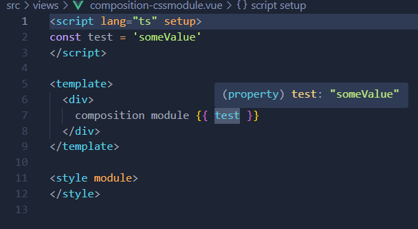
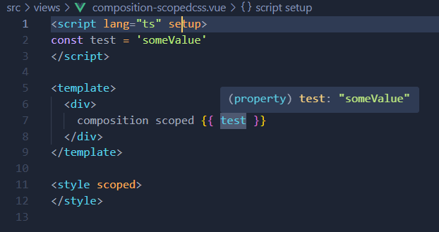
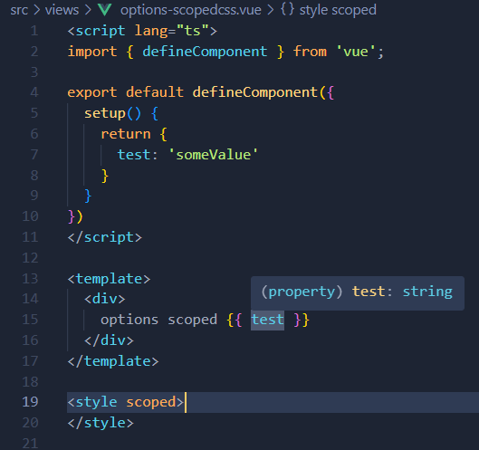
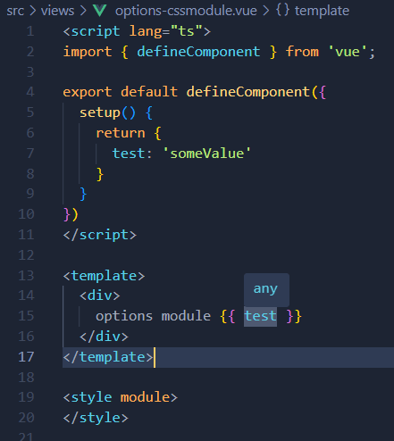

In VSCode with Volar open all files in `/src/views` and hover the `test` variable in the template

it seems to be `string` in **Options API** and `"someValue"` in **Composition API**

* * *

but in options api with css modules all types in template fall to `any`. This is a minimal reproduce, but I faced this issue in a big legacy repo (vue 2.7, but works absolutely similarly)

